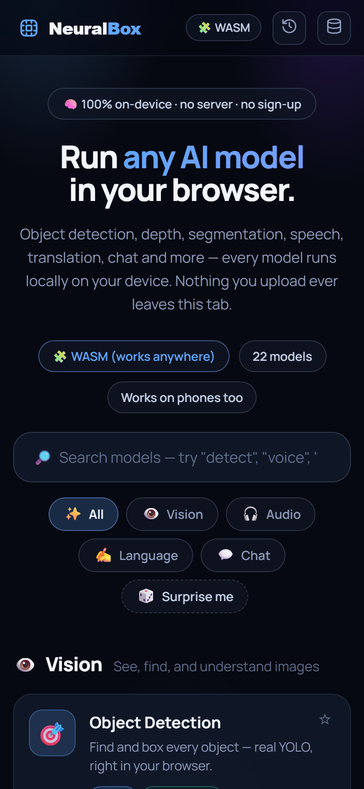
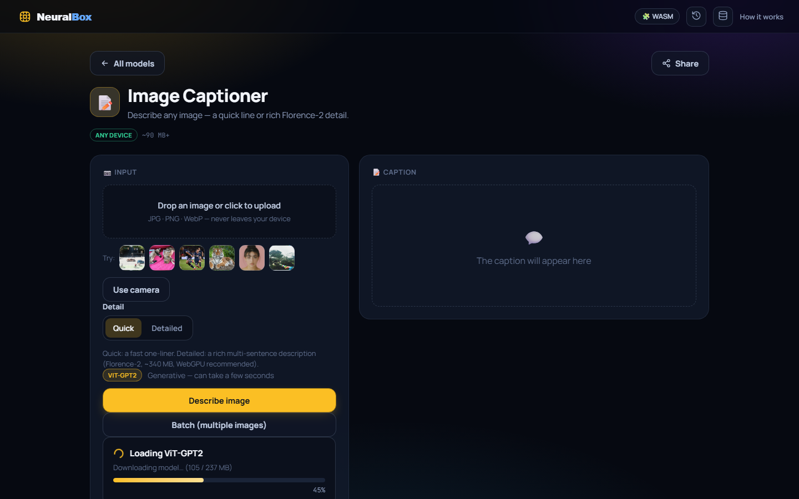
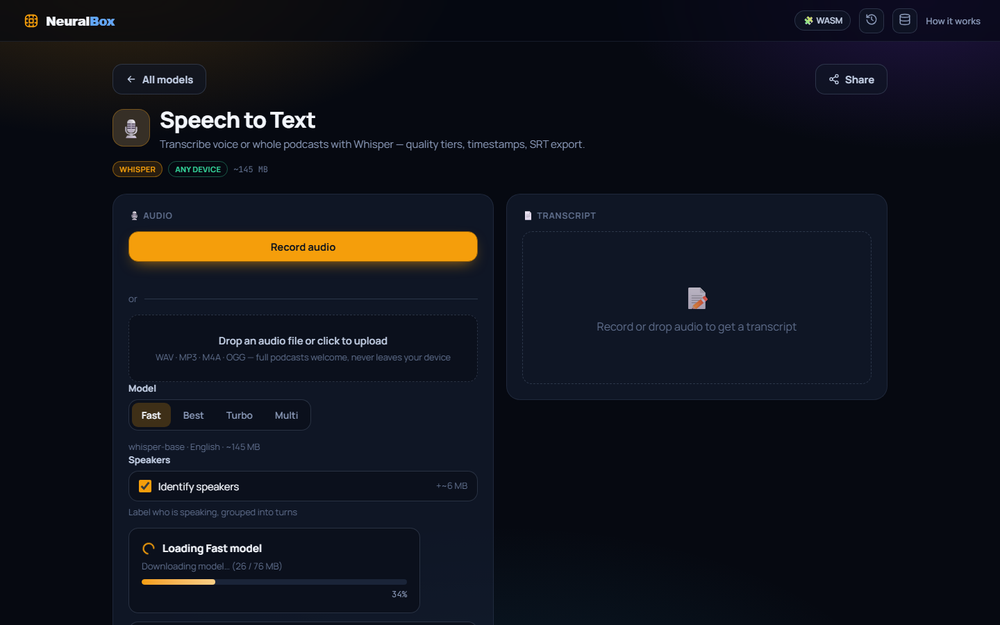
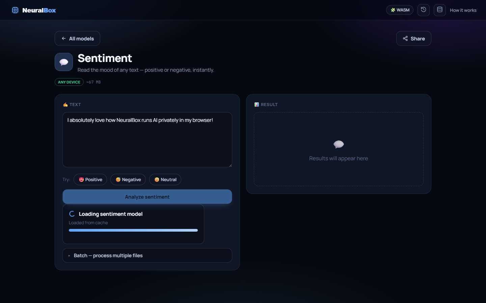
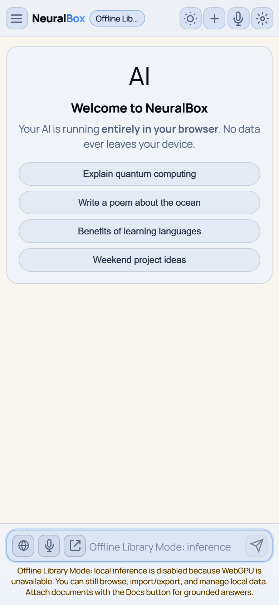

<div align="center">
  <div style="font-size: 3em; font-weight: bold; margin-bottom: 0.25em;">NeuralBox</div>
  <p><em>Run AI models and a powerful chatbot entirely in your browser. No server, no sign-up, no data leaves your device.</em></p>
  <p>
    <strong>Live app:</strong>
    <a href="https://neuralbox.infinitemind.space">https://neuralbox.infinitemind.space</a>
  </p>
</div>

<br />

NeuralBox is a local-first web application for in-browser machine learning and conversational AI. Every model runs **100% on-device** using **WebGPU** when available and transparently falling back to **WASM** when it isn't. It brings the power of state-of-the-art models straight to your hardware while ensuring 100% privacy.

---

## 📸 Screenshots

Captured from the live app at [neuralbox.infinitemind.space](https://neuralbox.infinitemind.space). Media lives in [`docs/assets/`](docs/assets/).

### Studio gallery

| Desktop | Mobile |
|:-------:|:------:|
|  |  |

### Vision, audio & language studios

| Object Detection | Image Captioner |
|:----------------:|:---------------:|
|  |  |

| Speech to Text | Sentiment |
|:--------------:|:---------:|
|  |  |

### Pro Chat

| Desktop | Mobile |
|:-------:|:------:|
|  |  |

---

## ✨ Features

- 🔒 **100% Private:** Inference and conversation storage are fully local. Your data never leaves your device.
- ⚡ **WebGPU Accelerated:** Real-time generation powered by hardware acceleration.
- 🛠️ **19 In-Browser Studios:** Task-specific studios for vision, audio, language, and chat models.
- 🖼️ **Multimodal Capabilities:** Drag, drop, or paste images for vision analysis (with supported models).
- 🎙️ **Voice Mode & Whisper ASR:** Enjoy hands-free dictation and a fullscreen Voice Chat mode, powered by localized Transformers.js. Whisper is preloaded and streams text to your screen in real time.
- 📚 **Local RAG (Document Q&A):** Attach `.md`, `.txt`, `.csv`, `.json`, code, or log files to ground the AI's knowledge base securely on-device with smart citations.
- 🌐 **Web-Enhanced Mode:** Optional DuckDuckGo-powered web lookups for up-to-date answers.
- 🛡️ **Trust & Telemetry:** Full visibility into routing decisions, context lengths, and RAG confidence scores via the Trust Layer and Runtime Workbench.

---

## 🏛️ Application Layouts

NeuralBox is built as a multi-page Vite application:
1. **Studios Shell (`index.html`)**: The main landing page hosting 19 specialized model studios.
2. **Pro Chat (`chat.html`)**: The full WebLLM-powered assistant (with model picker, RAG, web search, voice, and vision). It requires WebGPU and is also embedded as a studio.

### Specialized Model Studios

Open the gallery and pick a model. Each studio downloads its model once, caches it in the browser, and then runs offline.

#### Vision
- 🎯 **Object Detection** — Real YOLO (YOLOS-tiny) with a live camera mode.
- 🔭 **Find Anything** — Zero-shot detection of any object you name (OWL-ViT).
- 🏷️ **Image Labeler** — 1000-class classification (ResNet-50 / ViT).
- 🔮 **Zero-Shot Vision** — Score an image against any labels you type (CLIP).
- 🧩 **Segmentation** — Per-pixel scene parsing (SegFormer).
- 🌀 **Depth Map** — Turn any photo into a 3D depth map (Depth Anything V2).
- ✂️ **Background Remover** — Cut out the subject, export a transparent PNG (RMBG).
- 📝 **Image Captioner** — A quick line (ViT-GPT2) or rich, multi-sentence **Florence-2** detail.

#### Audio
- 🎙️ **Speech to Text** — Transcribe voice or **whole podcasts** with Whisper (base/small/distil tiers + multilingual), timestamps, and SRT/TXT export.
- 🔊 **Text to Speech** — Natural neural voices (**Kokoro-82M**, 11 voices, adjustable speed, reads long text).
- 👂 **Sound Classifier** — Identify 500+ sound events (AST / AudioSet).

#### Language
- 💬 **Sentiment** · 🎭 **Emotion** (7-way) · 🧷 **Zero-Shot Text** · ❓ **Q&A** (DistilBERT/SQuAD) · 📚 **Summarizer** · 🌍 **Translator** (OPUS-MT) · 🔎 **Semantic Search** (embeddings) · 🔖 **Entity Finder** (NER) · 🧠 **Fill in the Blank** (BERT).

#### Chat
- 🤖 **Mini Chat** — A tiny streaming LLM (Qwen2.5 / SmolLM2 / Llama-3.2) that runs on any device.
- 💎 **Pro Chat** — The full WebLLM assistant (model picker, RAG, web search, voice, vision). Lives at `/chat.html` and is embedded as a studio.

### Studio Niceties
- **Pipelines** — "Send result to →" pipes one studio's output into another (e.g. transcribe a podcast → summarize → find entities; caption → translate).
- **History** — Captions, transcripts, summaries, translations, and chat replies are saved locally; reopen, copy, or reuse them from the top bar.
- **Live camera** — Real-time inference for detection, classification, zero-shot vision, segmentation, and depth.
- **Batch** — Caption or background-remove many images at once.
- **Paste / drop anywhere** — Drop or paste an image to jump straight into a vision studio. **Share** a deep link to any studio.
- **Quality tiers** — Most studios offer a Fast default plus an **Accurate** (or Detailed/Max) tier with a stronger model (e.g. DETR & YOLOS-small detection, CLIP ViT-B/16, SegFormer-B2/B5, DeBERTa-v3 zero-shot, RoBERTa-SQuAD2 Q&A, BGE/GTE embeddings), so you can trade speed for genuine accuracy.
- **Honest model sizes** shown before you commit to a download.
- **Installable PWA** — Add to your home screen; works offline after first load.
- **Pin favorites + recents** — Surfaced at the top of the gallery (stored locally).
- **Storage panel** — See and clear cached model weights from the top bar.
- **Search + category filters** in the gallery.

---

## 🛠️ Technology Stack

- **[Vite](https://vitejs.dev/)** - Lightning fast dev server & build tool
- **[@mlc-ai/web-llm](https://webllm.mlc.ai/)** - In-browser LLM inference via WebGPU
- **[@huggingface/transformers](https://huggingface.co/docs/transformers.js/index)** - In-browser ML models
- **[kokoro-js](https://github.com/huggingface/kokoro-js)** - Natural Text-to-Speech
- **Vanilla JS + CSS** - Zero framework overhead

---

## 📋 Requirements

- **Node.js**: `>=20 <26`
- **Browser**: A modern browser with WebGPU support enabled (Latest Chrome, Edge, or Firefox) for local AI inference.
- **Android**: Local chat requires Chrome/Edge on Android with a usable WebGPU adapter, not just the `navigator.gpu` API. If Android cannot provide an adapter, NeuralBox opens Offline Library Mode instead of leaving the chat composer in a silent broken state.
- **iOS/iPadOS**: The app shell, local library, settings, import/export, and PWA install path are supported. Local model inference only works if the iOS browser session exposes WebGPU and a compatible adapter; otherwise NeuralBox opens Compatibility/Offline Library Mode.
- **Offline/PWA shell**: Once installed or cached, NeuralBox still opens without internet or WebGPU so you can access settings, local conversations, imports/exports, and the app shell. Model inference still requires WebGPU and a previously available/cached model runtime.
- **Cached offline inference**: After a model and the WebLLM runtime chunks have been loaded once online, the service worker runtime-caches the ML chunks and WebLLM can reuse its cached model assets offline. Uncached models still need internet for first download.
- **Cross-Origin Isolation**: Cross-origin isolation headers (`COOP: same-origin`, `COEP: require-corp`) are configured in `vite.config.js` for both dev and preview. These are required for SharedArrayBuffer (multi-threaded WASM) and WebGPU to work correctly. Ensure your hosting platform serves these headers as well.

---

## 🚀 Getting Started

### Live deployment

The production app is available at:

- **Studios:** [https://neuralbox.infinitemind.space](https://neuralbox.infinitemind.space)
- **Pro Chat:** [https://neuralbox.infinitemind.space/chat.html](https://neuralbox.infinitemind.space/chat.html)

Cross-origin isolation headers (`COOP` / `COEP`) are required for WebGPU and multi-threaded WASM. Production hosting should serve the headers defined in `vercel.json`.

### 1. Install Dependencies
```bash
npm install
npm run env:check
```

### 2. Start the Development Server
```bash
npm run dev
```
> **Note for Local Network Access**: The Vite dev server is configured with `@vitejs/plugin-basic-ssl` to serve HTTPS automatically. This ensures secure contexts (`https://`) are met so that WebGPU features can function perfectly when testing on phones or other computers in your local network.

---

## 🧪 Testing & Validation

NeuralBox enforces strict reliability and accessibility standards. You can run the test suites locally:
```bash
npm run build                      # builds both pages + all studio chunks
npm run test:stability             # run stability checks
npm run test:studio                # Playwright smoke: gallery, routing, studio mount, zero console errors
npm run doctor                     # verify every catalog model still resolves on the Hub
npm run test:browser:lifecycle     # Pro Chat lifecycle smoke
npm run test:offline:pwa           # run PWA offline suite
npm run test:android:chat          # run Android compatibility tests
npm run test:ios:compat            # run iOS compatibility tests
npm run test:browser:mobile        # run mobile browser smoke test
npm run test:browser:offline-shell # run offline-shell browser smoke test
npm run test:rendering             # run rendering tests
npm run test:routing               # run routing tests
npm run test:rag:helpers           # run RAG helper test suite
npm run test:accessibility         # run accessibility static checks
```

Real end-to-end inference checks (download → run → assert) live in:
- `scripts/studio-run-check.mjs` (`STUDIO=<id> [CLICK_TIER=<label>]`)
- `scripts/studio-audio-check.mjs`
- `scripts/studio-chat-check.mjs`
- `scripts/pipeline-check.mjs`

These are driven by `scripts/e2e-manifest.mjs`. CI runs the build, node suites, and the studio smoke tests on every push/PR.

---

## 🧠 Architecture & Model Catalog

### Source Layout
```
src/studio/
  main.js        bootstrap: shell + router + lifecycle + paste/drop + ctx services
  runtime.js     the engine — lazy transformers.js, WebGPU/WASM pick, pipeline cache, media helpers
  models.js      central model catalog (M) — every id/dtype/size in ONE place
  registry.js    gallery metadata + lazy loaders + studio I/O map (for pipelines)
  studio-kit.js  createTierPicker / runWithLoader / deviceHint helpers
  router.js      hash router (#/ = home, #/<id> = studio)
  home.js        the launcher gallery
  state.js       favorites / recents / history (IndexedDB)
  handoff.js     panels.js   pipeline hand-off + history/send-to panels
  ui.js          shared UI toolkit (sx-* components)
  types.js       JSDoc contract typedefs
  styles/studio.css  design system
  tasks/<id>.js  one self-contained studio per model (sources specs from models.js)
```

- **Curated Models**: Curated model definitions are maintained within `src/lib/models.js` and intelligently routed via our custom heuristics. We offer both "Curated" models optimized for general use and "Advanced" models for specialized tasks. Note that models are cached securely in IndexedDB after their first download.
- **Studio Model Catalog**: Updates to studio models are done in **one place** (`src/studio/models.js`). `npm run doctor` checks every catalog model still resolves on the Hub. A weekly CI job runs it.
- **Dynamic Imports**: Each studio module default-exports `mount(host, ctx)` and is dynamically imported only when its route opens, so the gallery loads instantly and model weights download on first use.

---

## 🔒 Privacy

Inference and all storage are local to the browser. The only network calls are model weight downloads from the Hugging Face CDN (cached after first load) and — in Pro Chat only — optional web search queries sent to DuckDuckGo. Your images, audio, and text never leave your device.

---
<div align="center">
  Built with privacy in mind.
</div>
