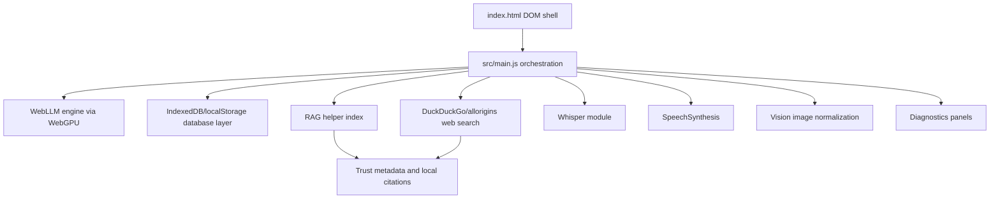

# Codebase Scan - 2026-05-04

This document is a fresh scan of the repository at commit `f287f44` (`feat: add rag confidence citations and trust telemetry`). It is meant to be the shared starting map for deciding what to improve next.

## Snapshot

- Repository: `https://github.com/bhaskaraanjana/NeuralBox`
- Local path: `C:\dev\NeuralBox`
- Branch: `main`
- Package version: `1.6.0`
- Runtime target: Node `>=20 <26`
- Verified Node version during scan: `24.11.1`
- App type: client-only Vite single-page app
- Primary runtime: browser WebGPU via `@mlc-ai/web-llm`
- Voice runtime: local Whisper ASR via `@huggingface/transformers`

## What NeuralBox Is

NeuralBox is a local-first browser AI chat app. It runs language models in the user's browser, stores conversations and settings locally, and adds optional capabilities around web lookup, local document retrieval, vision input, voice input, and a voice-chat overlay.

The product promise is strongest when framed as:

- private by default
- no app backend
- local conversation storage
- optional network only for model assets and explicit web-enhanced answers
- explainable enough for users to understand model choice, RAG matches, and answer metadata

## Repository Shape

Core runtime files:

- `index.html` - static app shell and all runtime DOM IDs.
- `src/main.js` - main app orchestrator, state owner, event wiring, model lifecycle, generation, RAG, search, voice, vision, settings, import/export, and diagnostics.
- `src/style.css` - complete visual system and responsive layout.
- `src/whisper.js` - lazy-loaded local Whisper transcription pipeline.
- `src/db/database.js` - IndexedDB persistence with localStorage fallback and legacy migration.
- `src/lib/*.js` - extracted pure helpers for rendering, routing, RAG, device heuristics, trust metadata, composer actions, generation lifecycle, events, voice, and settings.

Support files:

- `scripts/*.mjs` - smoke tests, helper tests, environment check, browser lifecycle check.
- `doc/*.md` - existing implementation documentation, roadmap, references, gaps, and incident notes.
- `demo/rag/` - sample documents and RAG demo playbook content.
- `core/task.md` - project checklist grouped by priority.
- `rules.md` - engineering standards for future work.
- `PROGRESS.md` - historical session log and verification record.

## Architecture Map

The app is intentionally backend-free. The browser owns UI, model runtime, persistence, optional retrieval, and optional browser/media APIs.

## Runtime Flows

### Startup

1. `init()` checks WebGPU availability.
2. The database layer initializes and migrates old localStorage records if needed.
3. Settings, model selection, conversations, and RAG docs are loaded.
4. Device capability heuristics estimate GPU class, VRAM, and tier.
5. The model selector renders a recommended model and optional Auto mode.
6. WebLLM cache status is checked for the selected model.
7. The user starts the app and `CreateMLCEngine()` loads the model.
8. The chat screen renders conversations and the active runtime state.

### Generation

1. The composer resolves send/stop/no-op behavior through `src/lib/composer.js`.
2. `sendMessage()` creates a conversation if needed and stores the user message.
3. Optional local RAG matches and optional web search context are assembled.
4. Auto mode may route to a better model and hot-swap with progress events.
5. The app streams chunks from `engine.chat.completions.create()`.
6. The assistant message updates incrementally.
7. Trust metadata, citations, performance stats, and conversation persistence finish the flow.

### Auto Routing

- Task analysis lives in `src/lib/routing.js`.
- Model fit blends tier, thinking support, vision support, prompt complexity, routing profile, and device VRAM fit.
- Auto mode only routes when `modelSelectionId` is `__auto__`.
- Hot-swap failures are non-fatal: the app continues on the current model and records a fallback reason.

### Local RAG

- RAG accepts text-like docs and code/log formats.
- Current limits:
  - 24 docs
  - 5MB per file
  - 240,000 chars per doc
  - 900 char chunks
  - 160 char overlap
  - 4 matches per query
- Retrieval is lexical/token-scored, not embedding based.
- Citations include local document name, score, and confidence label.
- Trust metadata summarizes RAG document names and confidence distribution.

### Web Search

- Web-enhanced mode queries DuckDuckGo Lite through allorigins.
- A DuckDuckGo instant-answer fallback exists.
- Search results are injected into the system context and rendered as source citations.
- This path depends on third-party endpoints and is a natural reliability-improvement target.

### Vision

- Vision is gated by model capability.
- Images can be selected, pasted, or dropped.
- Images are normalized to landscape `1344x1008` for Phi-3.5 vision compatibility.
- Stored multimodal messages are normalized when reopened.
- There is a retry path for known WebLLM vision payload/embed-shape failures.

### Voice

- Mic input uses `MediaRecorder`, lazy-loads `src/whisper.js`, and inserts transcript text into the composer.
- Voice chat overlay runs a loop: listen, transcribe, generate, speak, then listen again.
- Text-to-speech uses browser `SpeechSynthesis` and prefers Google English voices when available.

### Persistence

Logical records are stored under a single IndexedDB object store:

- `settings`
- `conversations`
- `model_selection`
- `rag_docs`
- `migration_v1_local_storage`

Fallback storage uses localStorage keys prefixed with `db:`.

## Feature Inventory

Current working features:

- local streaming chat
- manual model selection
- Auto model routing with hot swap
- model fit indicators and startup cache status
- thinking mode for supported models
- local document RAG
- RAG confidence citations
- optional web-enhanced answers
- voice transcription
- voice chat overlay
- vision input for supported models
- conversation sidebar, search, pinning, deletion
- conversation JSON export/import
- active conversation Markdown export
- share-text copy
- prompt presets
- workflow modes
- trust metadata layer
- deterministic mode and seed
- runtime debug panel
- multimodal workbench panel

## Test And Validation Map

Validation run during this scan:

- `npm run env:check` - passed
- `npm run test:composer` - passed
- `npm run test:generation` - passed
- `npm run test:events` - passed
- `npm run test:voice` - passed
- `npm run test:settings` - passed
- `npm run test:rag:helpers` - passed
- `npm run test:rendering` - passed
- `npm run test:routing` - passed
- `npm run test:device` - passed
- `npm run test:trust` - passed
- `npm run test:ascii-ui` - passed
- `npm run test:stability` - passed
- `npm run test:rag:web` - passed
- `npm run build` - passed
- `npm run test:browser:lifecycle` against local preview - passed

Build output notes:

- `webllm` chunk is about 6MB minified.
- `transformers` chunk is about 869KB minified.
- Vite still emits large chunk warnings, which are expected for the current architecture but worth tracking.

Dependency audit notes from `npm audit --json`:

- 4 total vulnerabilities: 1 moderate, 2 high, 1 critical.
- Direct affected package: `vite` (`<=6.4.1` advisories).
- Transitive affected packages: `picomatch`, `postcss`, `protobufjs`.
- `fixAvailable` is true for all reported issues.
- Do not blindly run `npm audit fix` without validating Vite/WebLLM/Transformers behavior afterward.

## Current Strengths

- Clear local-first product direction.
- Good smoke-test coverage for extracted helper modules.
- Browser lifecycle smoke exists, which is rare and valuable for a vanilla JS app.
- Safety hardening already exists around rendered model output and citation URLs.
- Persistence layer is isolated from UI orchestration.
- RAG has guardrails, confidence labels, and user-visible explainability.
- Runtime debug/workbench panels provide a useful basis for future telemetry.

## Current Risks And Gaps

- `src/main.js` is still the main architectural pressure point at more than 4,500 lines.
- RAG retrieval is lexical only, so semantically related but keyword-poor answers may be missed.
- Web search relies on third-party endpoint shape and availability.
- Vision still carries a compatibility workaround for upstream WebLLM Phi-3.5 embed-shape constraints.
- Browser support is constrained by WebGPU, MediaRecorder, SpeechSynthesis, and local storage availability.
- Dependency audit has actionable vulnerabilities, including a direct Vite advisory.
- Accessibility is listed as planned but not yet completed.
- Chunk size remains high even with manual vendor chunking.

## Good Next Planning Areas

Recommended planning candidates:

1. Accessibility pass for settings, RAG, composer, dialogs, focus order, labels, and keyboard use.
2. Dependency upgrade sprint for Vite and transitive audit items, with full validation afterward.
3. Web-search recovery UX for offline/rate-limited/blocked endpoint states.
4. RAG retrieval profiles: precise, balanced, broad.
5. Further modularization of `src/main.js` into feature controllers.
6. Startup performance pass around lazy loading, chunk strategy, and optional runtime deferral.
7. Voice retry UX and optional transcript preview.
8. Vision smoke coverage and clearer failure recovery messaging.

## Suggested Development Guardrails

- Keep `src/main.js` behavior stable while extracting modules.
- Prefer pure helper modules plus small Node tests for logic changes.
- Run `npm run env:check`, targeted helper tests, `npm run test:stability`, and `npm run build` before merging changes.
- Run browser smoke when touching import/export, settings, send/stop, model switching, or layout-critical UI.
- Update `doc/KNOWN_GAPS.md`, this scan, or a feature-specific doc whenever behavior or risks change.

