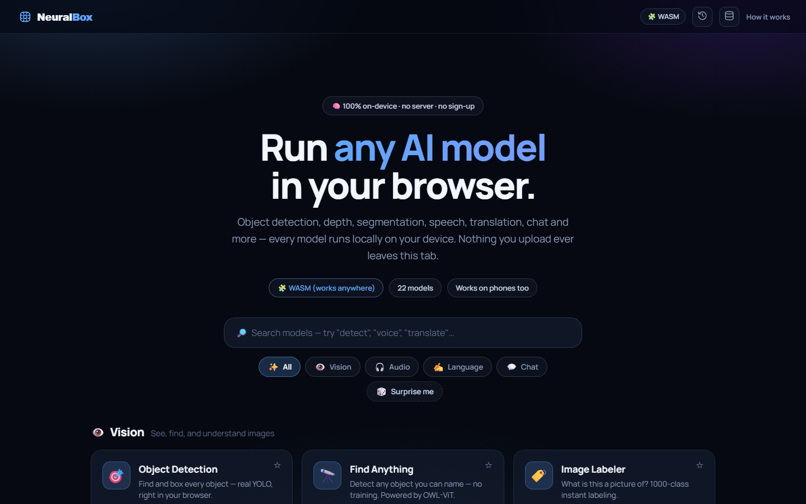
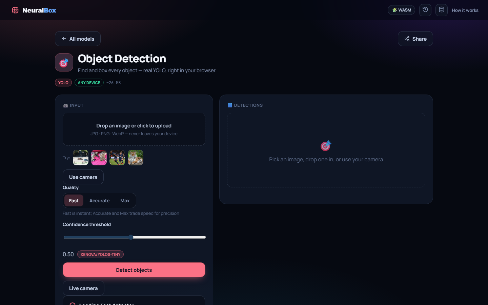
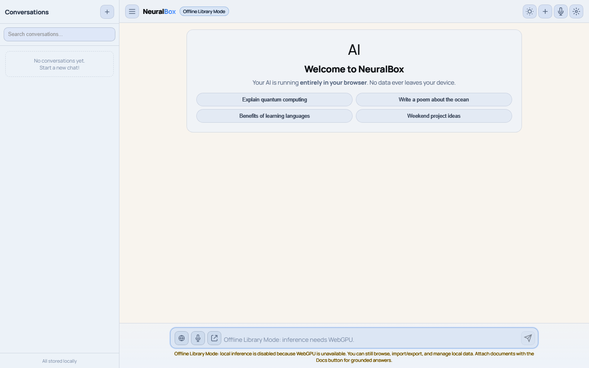

# Project Overview

## What NeuralBox Is

NeuralBox is a browser-only AI chat app built with Vite + vanilla JavaScript/CSS.  
It loads an MLC WebLLM model into browser GPU memory and runs inference locally (no app backend).

**Live app:** [https://neuralbox.infinitemind.space](https://neuralbox.infinitemind.space)  
**Pro Chat:** [https://neuralbox.infinitemind.space/chat.html](https://neuralbox.infinitemind.space/chat.html)

### Product screenshots

| Object Detection | Pro Chat |
|:----------------:|:--------:|
|  |  |

More captures and a walkthrough clip: [`docs/assets/`](../docs/assets/).

Core design goals:

- Local-first inference with WebGPU.
- Local conversation persistence in browser storage.
- Optional web augmentation (DuckDuckGo via proxy).
- Optional local speech transcription and browser text-to-speech.
- Model selection with explicit manual choice or `Auto` routing mode.
- Hot model swapping in-place during active chat sessions.

## Technology Stack

- Runtime UI: HTML + vanilla JS + CSS
- Build tool: Vite
- LLM runtime: `@mlc-ai/web-llm`
- Speech-to-text: `@huggingface/transformers` Whisper pipeline
- Browser APIs:
  - WebGPU (`navigator.gpu`)
  - `MediaRecorder` / `getUserMedia`
  - `SpeechSynthesis`
  - IndexedDB (with localStorage fallback in DB layer)

## Entry Points

- App shell: `index.html`
- Main app logic: `src/main.js`
- Voice transcription module: `src/whisper.js`
- Styling: `src/style.css`

## Runtime Screens

- Loading screen (`#loading-screen`)
  - Detects WebGPU
  - Detects rough device VRAM tier
  - Lets user pick model
  - Checks model cache status
- Chat screen (`#chat-screen`)
  - Sidebar conversation list
  - Chat messages
  - Input controls (search, think, mic, image, send/stop)
  - Hot-swap progress status in header
  - Optional runtime debug panel
  - Settings side panel
- Voice chat overlay (`#voice-chat-overlay`)
  - Full-screen conversational voice loop

## Startup Sequence (High Level)

1. `init()` runs.
2. WebGPU is checked.
3. Database is initialized and settings are loaded from the persistence layer.
4. Device capability estimate is computed.
5. Recommended model is selected (or persisted selection is reused, including `Auto`).
6. Model selectors are rendered (start screen + settings panel).
7. Cache status for selected model is checked.
8. User clicks start -> model loads via `CreateMLCEngine`.
9. App switches to chat screen and loads conversation history.
